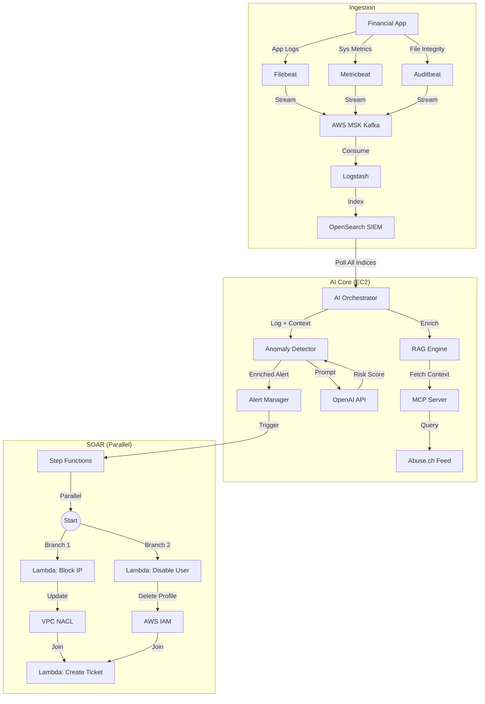

# Cybersecurity Threat Detection System on AWS (Financial Sector Demo)

An **AI-First**, **Agentic Security System** designed for high-risk financial environments. This project demonstrates a next-generation SOC pipeline where **Generative AI (LLM)** makes decisions based on real-time **Threat Intelligence (RAG)**, and **SOAR** executes parallel remediation actions.

## 1. System Architecture



### A. Ingestion (Data Collection)
-   **Source**: A simulated `Financial App` generates logs for:
    -   High Value Transactions (Fraud Simulation)
    -   Data Exports (Insider Threat Simulation)
    -   User Logins (Brute Force Simulation)
-   **Agents**: `Filebeat` (Logs), `Metricbeat` (Metrics), `Auditbeat` (Integrity).
-   **Buffering**: **AWS MSK (Managed Kafka)** ensures durable log transport.
-   **Processing**: `Logstash` consumes from Kafka -> Indexes to **OpenSearch**.

### B. Core Intelligence (AI + RAG)
*   **Philosophy**: "Pure AI Analysis". Rule-based filters are **DISABLED**.
*   **Workflow**:
    1.  **Orchestrator** (`ai_orchestrator.py`) picks up logs.
    2.  **Context Fetch** (`rag_engine.py`): Queries internal **MCP Server** (Abuse.ch Feodo Tracker) for IP Reputation.
    3.  **Generative Analysis** (`anomaly_detection.py`):
        -   Constructs a **Prompt**: `Log Entry` + `Threat Context`.
        -   Calls **OpenAI API** (`gpt-3.5-turbo`) to analyze the event.
        -   Output: JSON with `risk_score` and `reasoning`.

### C. Automated Response (Parallel SOAR)
*   **Orchestrator**: **AWS Step Functions**.
*   **Logic**: If `Severity == HIGH` or `Risk Score >= 0.8`:
    -   **Action 1 (Network)**: **Lambda (`soar-block-ip`)** adds DENY rule to NACL.
    -   **Action 2 (Identity)**: **Lambda (`soar-disable-user`)** deletes IAM Login Profile.
    -   **Final**: **Lambda (`soar-create-jira`)** creates a ticket with full audit trail + Link to SIEM.

## 2. AI Analyst Logic ("The Brain")

The core of this system is `anomaly_detection.py`, which acts as an autonomous cyber analyst.

### Strategy: Unbiased "General-Purpose" Detection
Unlike traditional IDS that looks for specific signatures (e.g., "failed password"), this AI is prompted to look for **ANY deviation from the CIA Triad** (Confidentiality, Integrity, Availability). This allows it to catch "Unknown Unknowns" (Zero-days, logic bugs) that rule-based systems miss.

### The System Prompt
Every log entry is evaluated against this rigid system prompt:
```text
You are an expert Cybersecurity AI Analyst. 
Your task is to detect anomalies, security threats, and suspicious behaviors in system logs.

Analyze the provided Log Entry and Threat Intelligence Context.
Focus on identifying ANY behavior that deviates from a secure baseline, such as:
- Unauthorized access attempts or privilege escalation.
- Unusual data movement or exfiltration.
- System integrity violations (unexpected file modifications).
- Abnormal resource usage patterns (potential DoS or crypto-mining).
- Execution of suspicious commands or connections to malicious IPs.
- Logic flaws or business process abuse.

Use the Threat Context to validate known malicious indicators.

Output valid JSON only:
{
    "risk_score": <float 0.0-1.0>,
    "reasoning": "<concise explanation of the anomaly or threat>"
}
```

## 3. Prerequisites

-   **Terraform** (v1.0+)
-   **AWS CLI** (configured with admin credentials)
-   **OpenAI API Key** (Required for the AI Engine)
-   **Jira Cloud Account** (URL, Email, API Token)

## 3. Configuration

This project uses a centralized configuration file for all sensitive secrets.

1.  Navigate to the infrastructure directory:
    ```bash
    cd infrastructure
    ```
2.  Copy the example variables file:
    ```bash
    cp terraform.tfvars.example terraform.tfvars
    ```
3.  Edit `terraform.tfvars` with your details (CRITICAL):
    ```hcl
    # JIRA Config
    jira_url       = "https://your-domain.atlassian.net"
    jira_user      = "email@example.com"
    jira_api_token = "ATBB..." 
    jira_project_key = "SEC"

    # AI Config
    openai_api_key = "sk-..." # Your OpenAI Key starting with sk-
    ```

## 4. Deployment

Deploy the entire stack (EC2, MSK, OpenSearch, Lambdas, Step Functions) with one command:

```bash
terraform init
terraform apply
```

> **Note**: Deployment takes 15-20 minutes. The `User Data` script on EC2 will automatically start the Python Analysis Engine and MCP Server using the variables provided in `terraform.tfvars`.

## 5. Verification & Usage

### 1. Check System Status
SSH into the EC2 instance to see the services running:
```bash
# Check Analysis Service
journalctl -u threat-detection.service -f

# Check Threat Intel Feed
journalctl -u mcp-server.service -f
```

### 2. Trigger an Attack
The `financial_app.py` automatically generates logs. You can simulate a specific attack:
-   **Brute Force**: Multiple failures for 'root'.
-   **Botnet Access**: Access from a known Abuse.ch IP (Mock or Real if traffic allows).

### 3. Observe SOAR Action
-   **Jira**: Check your Jira Project. A new ticket should appear with a link to OpenSearch.
-   **NACL**: Go to AWS VPC Console -> Network ACLs -> Check Inbound Rules. A DENY rule for the simulation IP should appear.

## 6. Directory Structure
-   `config/`: Beats & Logstash configurations.
-   `infrastructure/`: Terraform code (`main.tf`, `variables.tf`).
-   `src/`: Python source code.
    -   `analysis/`: AI Engine, Threat Intel, Orchestrator.
    -   `integration/`: MCP Server.
    -   `soar/`: Blocking & Jira Lambdas.
